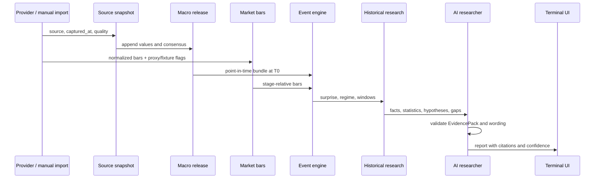

# Data flow

If data is missing, the pipeline degrades explicitly: a window can be
unavailable, historical output can fall back to cases, and the report records a
gap. Missing data is never silently synthesized.
