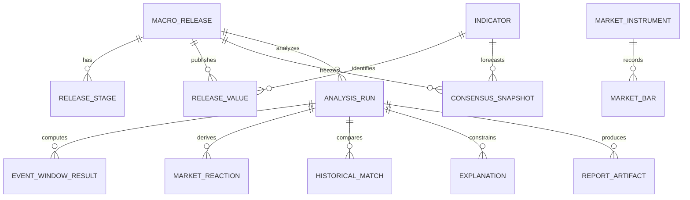

# Domain model

The aggregate root is `MacroRelease`, not a news story.

Release values and consensus snapshots are append-only. Every derived artifact
is linked to an `AnalysisRun` with methodology and code versions. Source
artifacts and data-quality records preserve provenance. FOMC stages are separate
time anchors, so statement and press-conference reactions are never collapsed
into one overnight move.
