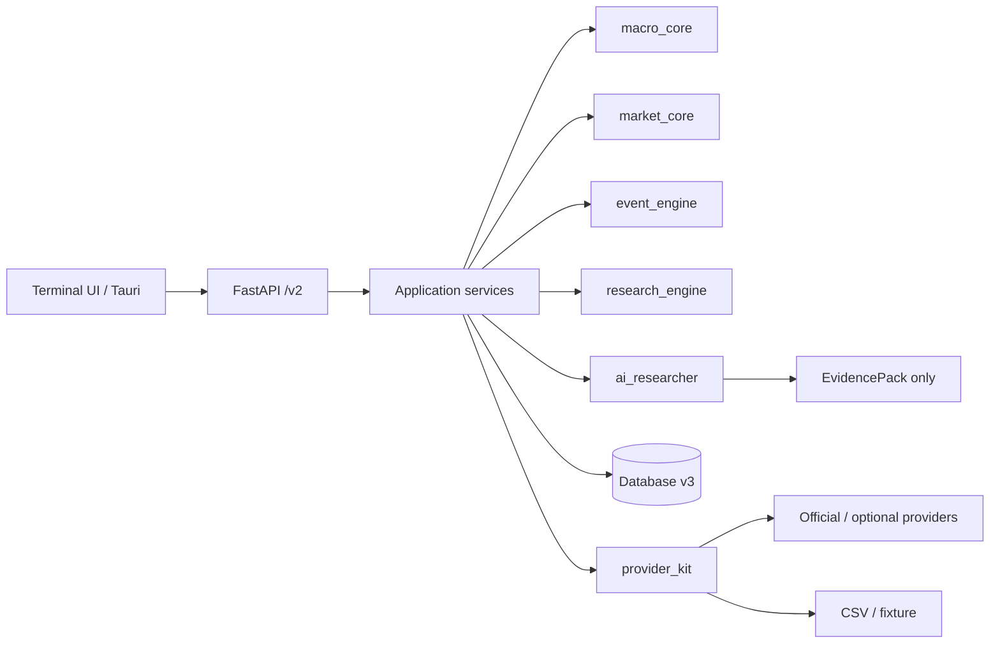

# System overview

WorldState is a modular monolith. Domain packages are independent of HTTP,
storage and external provider schemas; the application layer coordinates them.

`macro_core` owns indicators, releases and regimes. `market_core` owns
instrument identity and session rules. `event_engine` computes surprises and
event windows. `research_engine` matches historical cases. `ai_researcher`
validates and summarizes an EvidencePack. Provider and database models do not
become domain contracts.

The architecture-boundary test parses imports and fails when a foundational
package depends on a higher layer or when a legacy World Monitor domain returns.
