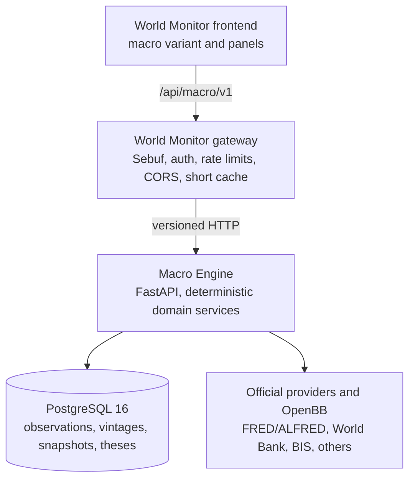

# World State Terminal architecture

Status: Phase 0 draft.

## Context

World State Terminal extends World Monitor; it does not replace it. The browser
retains the existing variant, panel, map, localization, command, settings, and
desktop patterns. Stateful point-in-time macro research lives in a separate Python
service behind the existing gateway boundary.

## Service boundaries

### World Monitor frontend

- renders the macro variant and reuses the existing `Panel` base class;
- never stores provider secrets or computes official state scores;
- shows provenance, `as_of`, data freshness, precision, and degraded states;
- consumes generated Sebuf clients through a macro service wrapper.

### World Monitor gateway

- validates inputs, permissions, CORS, and write tokens;
- forwards to Macro Engine and maps structured errors;
- keeps only bounded last-known-good and short response caches;
- does not reproduce the Python scoring or point-in-time algorithms.

### Macro Engine

- owns provider adapters, catalogs, ingestion, transforms, state computation,
  point-in-time filtering, revisions, research objects, and deterministic briefs;
- uses versioned methods and source snapshot hashes for reproducibility;
- starts without provider credentials and reports `not configured`;
- treats optional AI as an explanation layer, never a scoring input.

### PostgreSQL

- stores UTC timestamps and append-aware observation vintages;
- is migrated exclusively through Alembic in production;
- supports indexed as-of, latest-version, and revision queries;
- uses advisory locks for scheduled ingestion concurrency.

## Data flow

1. A catalog entry identifies a canonical series and its availability policy.
2. A provider returns validated domain records with source attribution.
3. Ingestion writes idempotent observations and a structured sync run.
4. Point-in-time queries filter `available_at <= requested_as_of`.
5. Deterministic transforms and scoring produce versioned snapshots.
6. The gateway exposes protocol objects; the frontend renders state and evidence.

## Deployment topology

- Local: Docker Compose with PostgreSQL, Macro Engine, and World Monitor web.
- Private server: the same services behind an operator-managed TLS boundary.
- Desktop Phase 1: connect to a configured local or private Macro Engine URL; do
  not bundle Python yet.
- Public deployment: writes disabled by default; secrets remain server-side.

## Failure modes

| Failure | Required behavior |
| --- | --- |
| provider credentials missing | service starts; provider is `not configured` |
| provider timeout or schema drift | isolate failure, retain last-known-good, emit warning |
| Macro Engine unavailable | gateway returns `service_unavailable`; UI shows cached timestamp |
| unknown availability time | exclude in strict mode; warn in best-available mode |
| database unavailable | health is degraded; no fabricated snapshot is returned |
| incomplete state coverage | lower confidence or return unavailable, never fill with zero |
| optional LLM unavailable | deterministic product remains fully usable |

## Security boundaries

Provider URLs are allowlisted. Logs redact credentials, tokens, passwords, and
connection strings. Write endpoints require `MACRO_WRITE_TOKEN` and are disabled
by default. Browser bundles contain no provider keys. CSV and thesis text require
formula-injection and content-sanitization defenses in their delivery phases.
